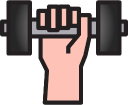
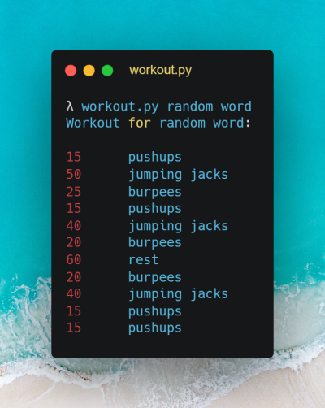

<div align="center">
  <a href="https://github.com/Marfullsen/work_out_by_a_random_word" rel="noopener">
    
  </a>
</div>

<h1 align="center">Work Out by a random word</h1>

<div align="center">

[](https://www.python.org/)

</div>

<div align="center">
  Enjoy exercising with random phrases or words.
</div>

## 📘 Updates 👀
- Docs added.

## 📝 Index 📂

- [About](#about)
- [Getting started](#getting_started)
- [Prerequisites](#prerequisites)
- [Installing](#installing)
- [Usage](#usage)
- [Deployment](#deployment)
- [Contribute](../CONTRIBUTING.md)
- [Built using](#built_using)
- [Authors](#authors)
- [Acknowledgement](#acknowledgement)

## 🧐 About <a name = "about"></a>

Simply choose a word or phrase and enjoy exercising with the exercises that we will propose.

<div align="center">
  <a href="https://github.com/Marfullsen/work_out_by_a_random_word" rel="noopener">
    
  </a>
</div>

## 🏁 Getting started <a name = "getting_started"></a>

Follow the instructions in the next steps to start working out.

### 📘 Prerequisites <a name = "prerequisites"></a>

- Install [Python](https://www.python.org/)

###  🔧 Installing <a name = "installing"></a>

Clone the prject

```sh
git clone https://github.com/Marfullsen/work_out_by_a_random_word.git
cd work_out_by_a_random_word
```

## 🎈 Usage <a name = "usage"></a>

Type `./workout.py word` to see the magic.

### More examples

```sh
./workout.py amazing
```

```sh
./workout.py super
```

```sh
./workout.py random word
```

```sh
./workout.py check it out
```

## 🚀 Deployment <a name = "deployment"></a>

No deployment needed.

## ⛏️ Built using <a name = "built_using"></a>

- [Python](https://www.python.org/) - The most accessible programming language available

## ✍️ Authors 👌 <a name = "authors"></a>

- [Marfullsen](https://github.com/Marfullsen) - Author.

## 🎉 Acknowledgement <a name = "acknowledgement"></a>

- [Top 10 Reasons Why Python is So Popular With Developers in 2022](https://www.upgrad.com/blog/reasons-why-python-popular-with-developers/)
- [Unsplash photo](https://unsplash.com/es/fotos/tOrJMH08lmg)
- <a href="https://www.flaticon.com/free-icons/gym" title="gym icons">Gym icons created by Payungkead - Flaticon</a>